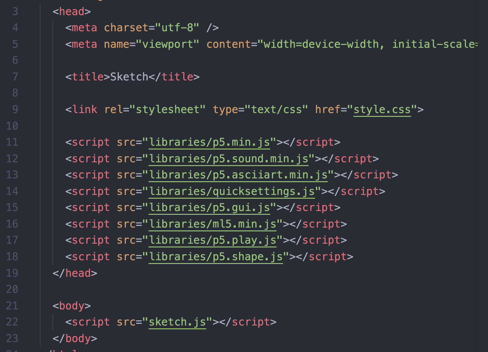
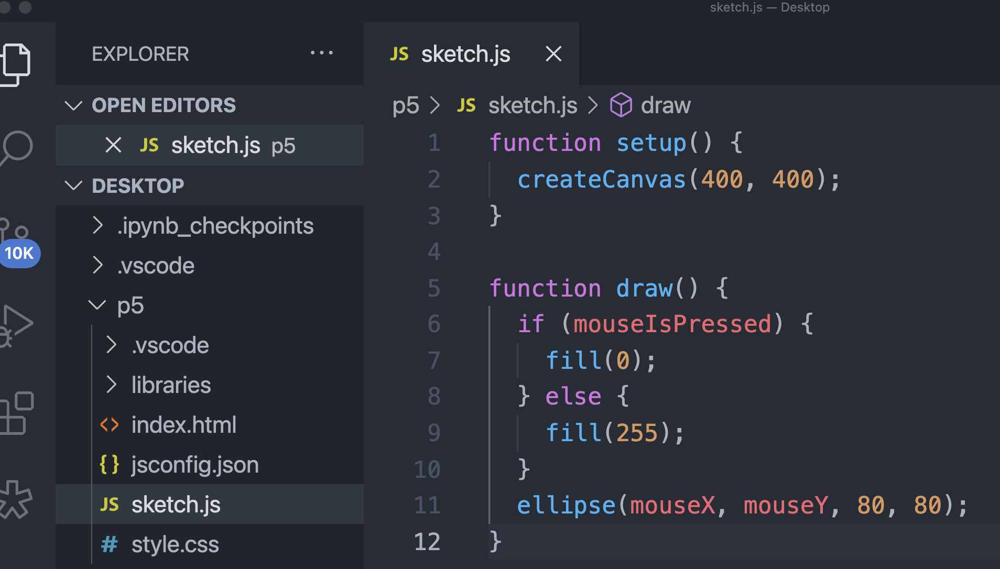
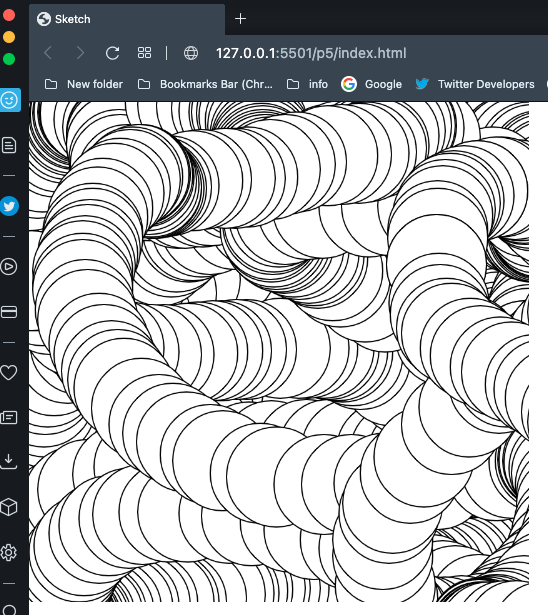

# JavascriptR
a repo for my Javascript learning 

- node JS allows for 3rd party apps

- https://generativeartistry.com/tutorials/hours-of-dark/

### for online web browser editor
- https://editor.p5js.org
- https://p5js.org/get-started/

## Using VS code editor to run p5.js

Step 1 - find p5 extensions, select **p5.vscode**


Step 2 - (om mac) `cmd` + `shift` + `p` which opens the search bar 
in VS Code, select **Create p5.js Project.**, then there is drop down menu
for which library you want to install.

step 2.1 - install these libraries
```
p5.min.js
p5.sound.min.js
p5.asciiart.min.js
quicksettings.js
p5.gui.js
ml5.min.js
p5.play.js
p5.shape.js
```

Step 3 - inside the _index.html_ file you should see these libraries automatically
placed in the file
 
 


Step 4 - enter your JavaScript code, save it and click
**live server** on the bottom of VS Code. This will open your web browser.



Step 5 - Art !



